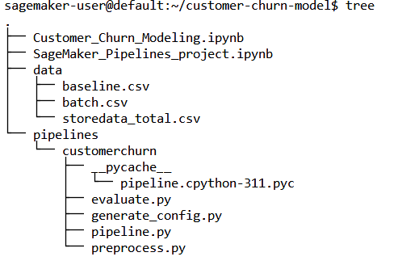
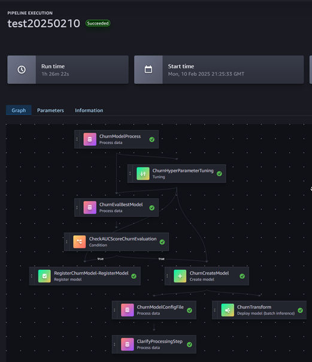
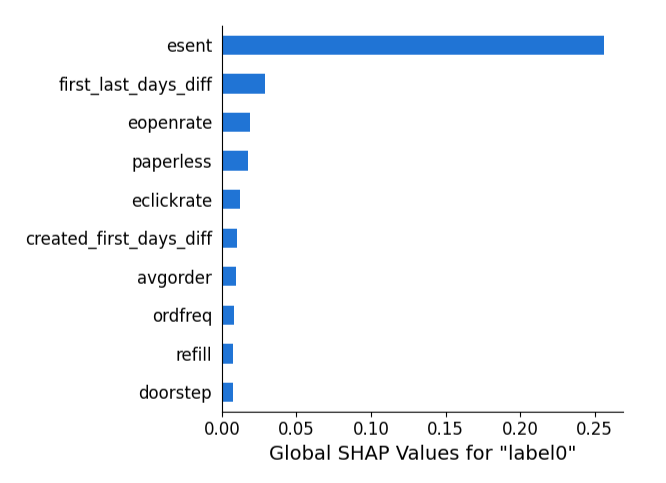
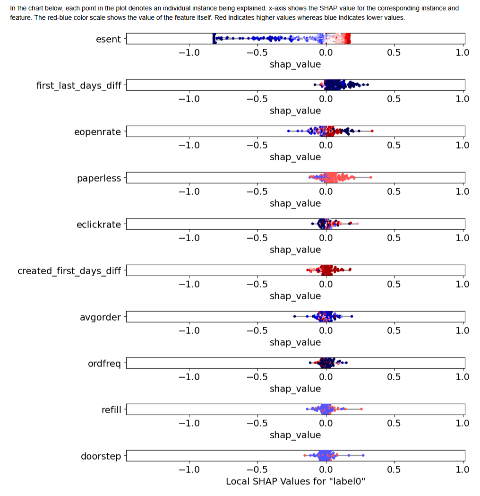

 

# Customer Churn Detection with Amazon SageMaker

## Objective

Build, tune, and deploy an end-to-end churn prediction model using **Amazon SageMaker Pipelines**.

## Introduction

Predicting customer churn before it happens provides an opportunity to take action and retain customers, which is crucial for revenue growth. Depending on the industry and business needs, churn prediction models can be complex and multi-layered.

This repository contains the code and results after orchestrating an **end-to-end churn prediction model** with the following steps:

- **Data preparation**
- **Experimenting with a baseline model**
- **Hyperparameter optimization (HPO)**
- **Training and tuning**
- **Registering the best model**

For this project, we utilize **Amazon SageMaker Studio** and its tools, including **JupyterLab, Pipelines, and Clarify**. SageMaker Studio helps data scientists and developers prepare, build, train, and deploy machine learning (ML) models efficiently.

---

## Recommended Workflow

### **1️⃣ Customer_Churn_Modeling.ipynb**

📂 **Notebook**: [Customer_Churn_Modeling.ipynb](./Customer_Churn_Modeling.ipynb)  

This **Jupyter Notebook** walks through building an XGBoost model for customer churn prediction. The steps include:

- **Preprocessing the Customer Retention Retail Dataset** → [Dataset Link](https://www.kaggle.com/uttamp/store-data)
- **Splitting and defining Train, Test, and Validation Datasets**
- **Hyperparameter Tuning (HPO)**
- **Training an XGBoost Model with SageMaker Debugger** and analyzing results

### **2️⃣ Prepare and Deploy the Pipeline Files**

#### **Understand the Workflow Components**

The AWS tutorial involves preprocessing data, defining a pipeline, training a model, and evaluating it. The files in the `pipelines/customerchurn` directory serve the following roles:

- [preprocess.py](./pipelines/customerchurn/preprocess.py) → Handles **data preparation and feature engineering**.
- [generate_config.py](./pipelines/customerchurn/generate_config.py) → Defines configurations such as **S3 paths, model parameters, and feature names**.
- [pipeline.py](./pipelines/customerchurn/pipeline.py) → Implements the **SageMaker pipeline**, orchestrating preprocessing, training, evaluation, and deployment.
- [evaluate.py](./pipelines/customerchurn/evaluate.py) → Evaluates the **trained model's performance**.

📂 **Deploy the files following this hierarchy** in your **EFS** (Elastic File System) associated with your **JupyterLab** environment.

---

### **3️⃣ Run the Pipeline with SageMaker_Pipelines_project.ipynb**

📂 **Notebook**: [SageMaker_Pipelines_project.ipynb](./SageMaker_Pipelines_project.ipynb)  

Finally, execute the **Jupyter Notebook** to run the pipeline.

> ⚠️ **Important:** This version includes a **fix for the original repository file**. Running the original version will result in failures in the last two workflow steps, preventing report generation. **I recommend using this version instead** (a pull request has been submitted for the fix).

---

## Results

### **✅ Pipeline Execution**

### **📊 [HTML Report](./report/report.html) (SageMaker Clarify Analysis)**

The SageMaker Clarify report provides a detailed dataset analysis, including:

1. **Analysis configuration**
2. **High-level model performance**
3. **Pretraining bias metrics**
4. **Posttraining bias metrics**
5. **Model explanations**

From the analysis, we conclude that the most influential factor in customer churn is the **number of emails sent**.

---

## References

- [AWS Blog](https://aws.amazon.com/blogs/machine-learning/build-tune-and-deploy-an-end-to-end-churn-prediction-model-using-amazon-sagemaker-pipelines/)
- [GitHub Repository: AWS Customer Churn SageMaker Pipelines Sample](https://github.com/aws-samples/customer-churn-sagemaker-pipelines-sample/tree/main)

---
